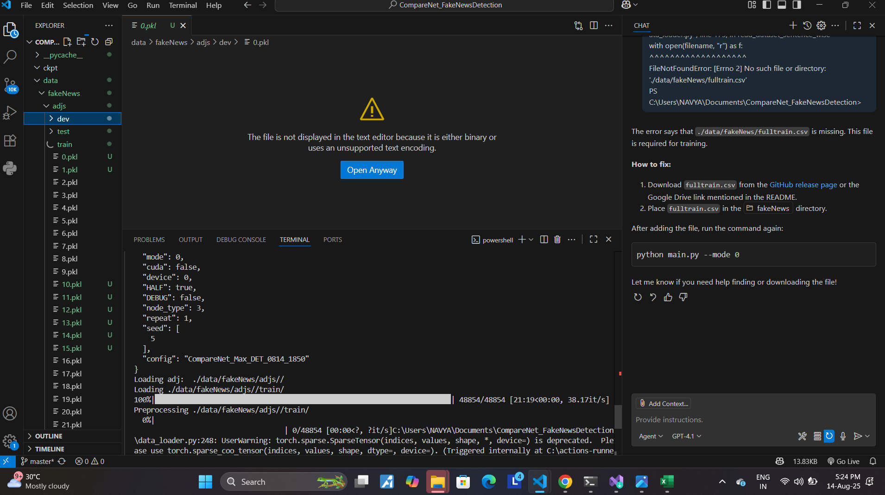

<div align="center" style="border:2px solid #1976d2; background:#f5faff; border-radius:10px; padding:16px; margin-bottom:24px;">
    <h1 style="margin:0; font-size:2.2em; font-family:Segoe UI,Arial,sans-serif; color:#222;">Submitted by <span style="color:#1976d2;">Navya Nayer</span></h1>
</div>

## Section D - Question 1


## Section D - Question 2


## Section D - Question 3: Running the Assigned GitHub Repo

### Assigned Repository
[CompareNet_FakeNewsDetection](https://github.com/BUPT-GAMMA/CompareNet_FakeNewsDetection)

#### Steps Taken
1. Cloned the repository to local machine.
2. Downloaded and installed all required dependencies using the provided requirements file (`requirements.txt`).
3. Ran the basic training script as per the instructions in the repo.

#### Result
- The basic training ran successfully, as shown below:



- Evidence of missing file is shown below:


#### Issue Encountered
- During execution, the following error occurred:

```
File "C:\Users\NAVYA\Documents\CompareNet_FakeNewsDetection\data_loader.py", line 175, in read_dataset_sentence_wise
    with open(filename, "r") as f:
         ^^^^^^^^^^^^^^^^^^^
FileNotFoundError: [Errno 2] No such file or directory: './data/fakeNews/fulltrain.csv'
```

- The required file `./data/fakeNews/fulltrain.csv` is missing.
- The link provided in the repository's README does **not** contain this file.

#### Conclusion
- Training can only proceed if the missing data file is provided or generated.
- Please refer to the attached screenshot for evidence of successful initial training run and the encountered error.
