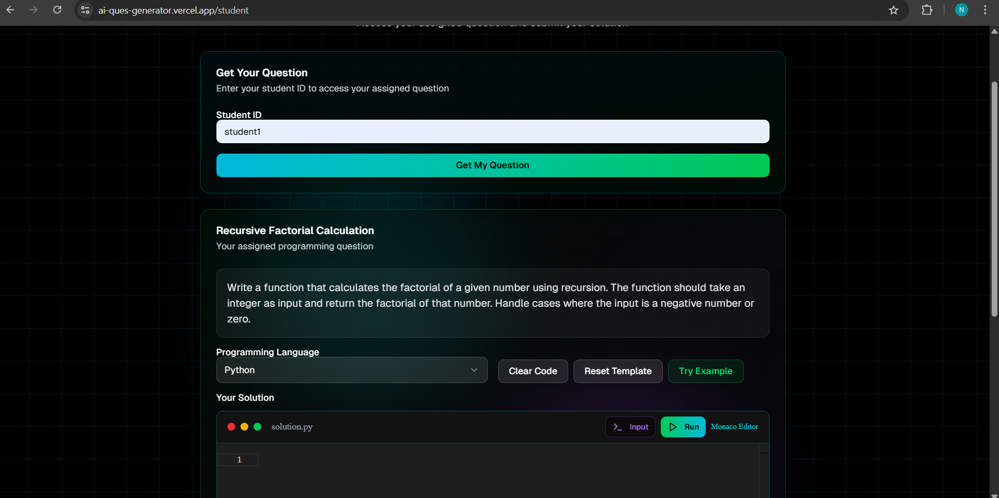
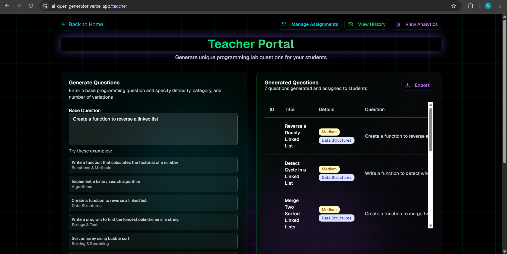

<div align="center">
<h1>Submitted by Navya Nayer</h1>
</div>


## Section D - Question 1

**Live Demo:** [ai-ques-generator.vercel.app](https://ai-ques-generator.vercel.app/)

**GitHub Repository:** [NavyaNayer/AI_Ques_Generator](https://github.com/NavyaNayer/AI_Ques_Generator)

**Key Features:**
- AI-powered question generation with multiple types, difficulty levels, and customizable topics
- Export questions in various formats
- Professional code editor (Monaco) with syntax highlighting, IntelliSense, and multi-language support
- Real-time code execution via Judge0 API for 6+ languages, with stats and error handling
- Student analytics: progress tracking, history, performance metrics, exportable reports
- Multi-role system: Teacher portal (create/manage/analyze), Student portal (practice/track), role-based access
- Modern UI: neon colors, animated effects, glassmorphism, responsive dark theme

**Portal Screenshots:**


<div align="center"><b>Landing Portal</b></div>


<div align="center"><b>Student Portal</b></div>


<div align="center"><b>Teacher Portal</b></div>


## Section D - Question 2


## Section D - Question 3: Running the Assigned GitHub Repo

### Assigned Repository
[CompareNet_FakeNewsDetection](https://github.com/BUPT-GAMMA/CompareNet_FakeNewsDetection)

#### Steps Taken
1. Cloned the repository to local machine.
2. Downloaded and installed all required dependencies using the provided requirements file (`requirements.txt`).
3. Ran the basic training script as per the instructions in the repo.

#### Result
- The basic training ran successfully, as shown below:


- Evidence of missing file is shown below:


#### Issue Encountered
- During execution, the following error occurred:

```
File "C:\Users\NAVYA\Documents\CompareNet_FakeNewsDetection\data_loader.py", line 175, in read_dataset_sentence_wise
    with open(filename, "r") as f:
         ^^^^^^^^^^^^^^^^^^^
FileNotFoundError: [Errno 2] No such file or directory: './data/fakeNews/fulltrain.csv'
```

- The required file `./data/fakeNews/fulltrain.csv` is missing.
- The link provided in the repository's README does **not** contain this file.

#### Conclusion
- Training can only proceed if the missing data file is provided or generated.
- Please refer to the attached screenshot for evidence of successful initial training run and the encountered error.
